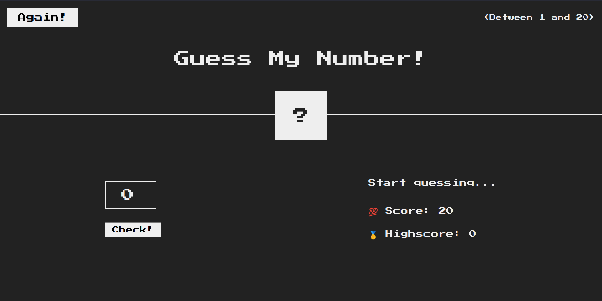
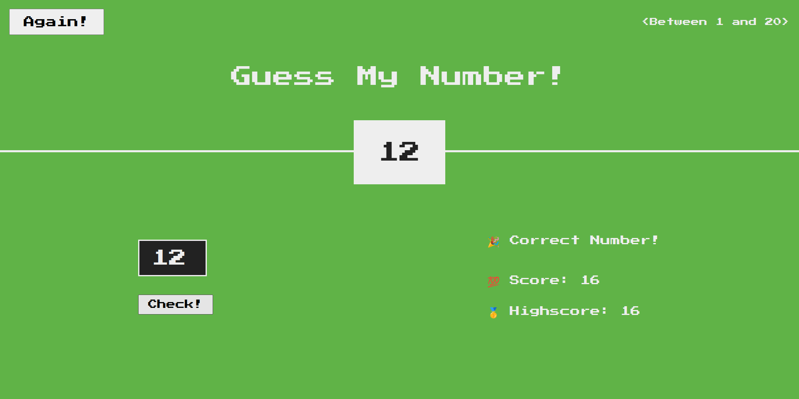
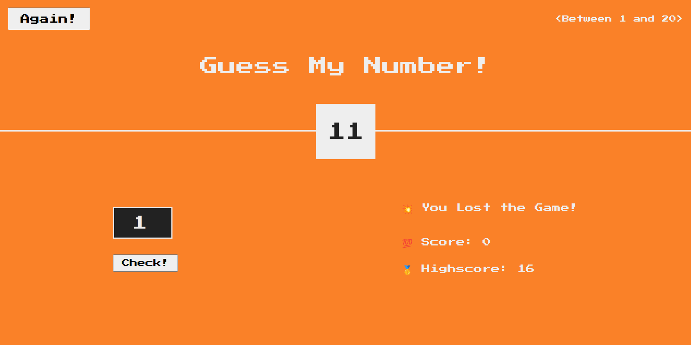

# Guess The Number Game
Welcome to "Guess the Number!", a thrilling game where your intuition and luck will be put to the test. Your objective is simple: guess the mysterious number chosen by the game within 20 attempts. But be cautious, for every incorrect guess brings you closer to the edge!

## How to Play:
1. You have 20 chances to guess the random number between 1 and 20.
2. Enter your guess in the input field provided and click 'Check'.
3. Based on your guess, you'll receive feedback:
    - If your guess is too high, you'll be notified with "Too High".
    - If your guess is too low, you'll be notified with "Too Low".
    - If your guess is correct, congratulations! You've cracked the code.
4. Your score will be calculated based on the number of attempts taken. Aim for the lowest score possible!
5. Keeps track of your high score as you strive to beat your personal best.

## Features:
Embark on an exciting journey of number guessing with "Guess the Number!".

1. **Intuitive User Interface**: Enjoy a sleek and user-friendly interface designed to enhance your gaming experience.
2. **Random Number Generation**: The game generates a random number between 1 and 20 for each round, ensuring unpredictability and excitement.
3. **Feedback Mechanism**: Receive instant feedback on your guesses. Whether your guess is too high or too low, the game guides you towards the correct answer.
4. **Challenging Gameplay**: With only 20 attempts at your disposal, every guess counts. Test your strategy and intuition as you strive to uncover the hidden number.
5. **Score Tracking**: Keep track of your score with each guess. Aim to achieve the lowest score possible to showcase your guessing prowess.
6. **High Score Recorder**: Challenge yourself to beat your personal best. The game records your high score, motivating you to improve with each playthrough.

## Development:
* **HTML**: The structure of the game interface is built using HTML, providing the foundation for interactive elements.
* **CSS**: CSS styles are applied to enhance the visual appeal of the game, ensuring a polished and engaging design.
* **JavaScript**: The game logic is implemented using JavaScript, including random number generation, user input processing, feedback mechanism, and score tracking.

Are you ready to embark on this thrilling guessing adventure? Test your luck and sharpen your intuition in "Guess the Number!"
